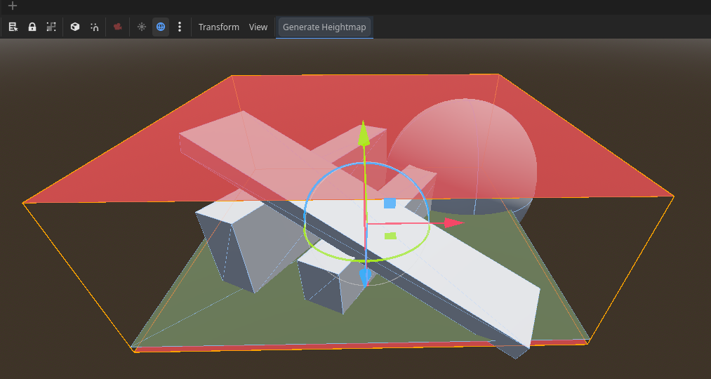
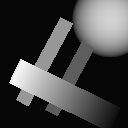
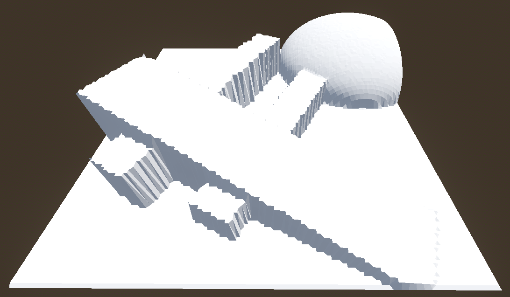
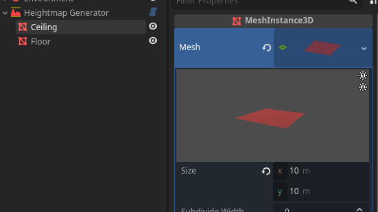

# Godot-4-HeightmapGenerator
Generates a heightmap texture from collidable meshes in a 3D scene. 

## Description

A lightweight editor plugin to generate a grayscale heightmap from a scene's
terrain and collision meshes.

## Table of Contents

- [Installation](#installation)
- [Usage](#usage)
- [Contributing](#contributing)
- [License](#license)
- [Contact](#contact)

## Installation

Move the `addons` folder into your project's `res://addons/` folder. No other
files are necessary.

## Usage

1. Enable the plugin via `Project` > `Project Settings...` > `Plugins`
2. Open the scene you wish to generate a heightmap for
3. Add a new Heightmap Generator node to the scene. You will notice 2 child
nodes, a Floor and a Ceiling, both mesh planes.
4. Move the Floor plane to the lowest point in your scene.
5. Move the Ceiling plane to the highest point in your scene.
6. Resize the Ceiling plane using the mesh's size properties or by scaling it.
Note that both the size (x and y) and scale (x and z) must be square, since
we are generating a square image.

7. Click on the parent node once again and set your desired image resolution
and save path (default is the addon's output/ folder).

## Contributing

Contributions are very much welcome. This was made partly as an exercise to
learn some editor/plugin scripting, and surely this can be expanded for other
use cases, or made more simple to use.

## License

This project is licensed under the [MIT License](LICENSE).

## Contact

- [GitHub](https://github.com/DavidDurston)